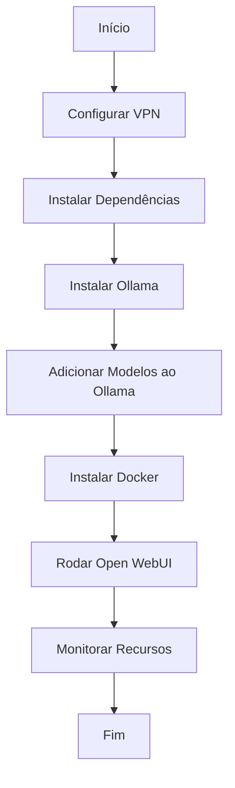
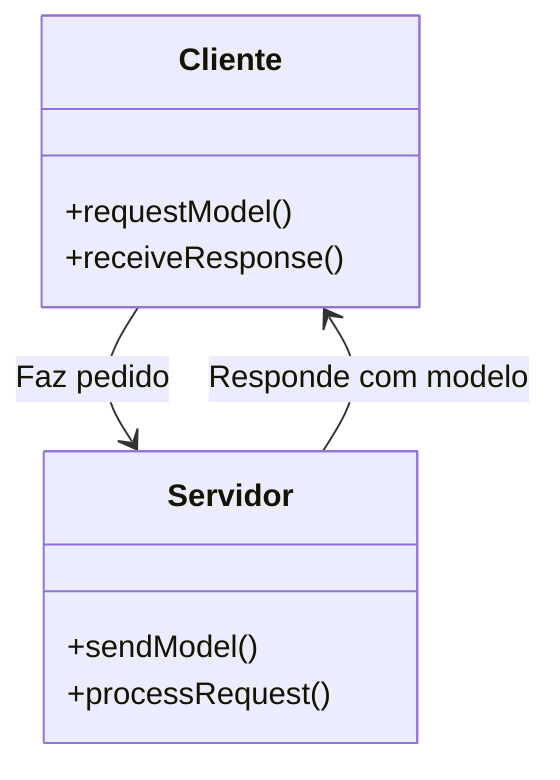

# Hub de IA

## Descrição do Projeto

Este projeto é um hub centralizado para gerenciar, instalar e executar inteligência artificial localmente. Ele oferece uma interface para a instalação de software necessário, gerenciamento de modelos, monitoramento de hardware e execução de uma interface de usuário web (WebUI).

No caso, ele é derivado desse tutorial: [host ALL your AI locally](https://youtu.be/Wjrdr0NU4Sk), e fiz para resolver a falta de Inteligencia artificial na empresa que trabalho, apenas para definir como portifolio.

No caso, o que bolei foi um script interativo para instalar em servers Linux. Assim, qualquer computador na rede pode consumir modelos de acordo com o setor, podendo cada modelo ser treinado com documentações de procedimentos e anomalias que precisam ser corrigidas. (já pensei numa "rede neural" para isso)

## Funcionalidades

- Instalação do Ollama para gerenciamento de modelos de IA.
- Adição e gerenciamento de diferentes modelos de IA.
- Monitoramento em tempo real dos recursos do sistema (GPU, CPU, memória).
- Instalação e execução do Docker para gerenciamento de contêineres.
- Execução do Stable Diffusion e Pyenv para geração de imagens.


## Fluxograma de Implementação e Funcionamento

### 1. Fluxograma Procedural para Implementar numa VPN



### 2. Fluxograma de Classes Representando Cliente e Servidor



## Estrutura do Projeto

```
projeto-hub-ia/
├── main.sh
├── modules/
│   ├── install.sh
│   ├── resources_monitor.sh
│   ├── docker_setup.sh
│   └── model_manager.sh
└── README.md
```

## Contribuição

Fique a vontade para fazer um pull request, ou faça um fork.

## Licença

Este projeto está licenciado sob a MIT License. Faça o que quiser, só não me processe.
---

Me faz um pix?
pedromota.nubank.com@gmail.com
