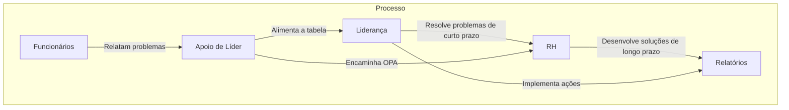

# Hábito Organizacional

Desenvolvi uma solução para melhorar a comunicação entre a operação e a liderança. Criei uma tabela no Google com um script que gera prompts, permitindo a geração de soluções de curto prazo para a liderança e de médio e longo prazo para o RH, utilizando modelos generativos.



## Gerador de Prompts em App Script

Abaixo está o código do gerador de prompts que utiliza App Script:

```appscript
function gerarPromptCSV() {
  // Acessando as planilhas
  var spreadsheet = SpreadsheetApp.getActiveSpreadsheet();
  var contextoSheet = spreadsheet.getSheetByName("Contexto");
  var opaSheet = spreadsheet.getSheetByName("OPA");
  var dadosSheet = spreadsheet.getSheetByName("Dados");
  
  // Coletando os dados da planilha "Contexto"
  var contextoRange = contextoSheet.getRange("A1:B" + contextoSheet.getLastRow());
  var contextoValues = contextoRange.getValues();

  // Coletando os dados da planilha "OPA"
  var opaRange = opaSheet.getRange("A1:C" + opaSheet.getLastRow());
  var opaValues = opaRange.getValues();

  // Coletando os dados da planilha "Dados"
  var dadosRange = dadosSheet.getRange("A1:A" + dadosSheet.getLastRow());
  var dadosValues = dadosRange.getValues();

  // Montando o prompt em formato CSV com delimitador '|'
  var prompt = "### CONTEXTO (CSV) ###\n";
  contextoValues.forEach(function(row) {
    prompt += "|" + row.join("|") + "|\n"; // Adiciona o delimitador | no início e final de cada linha
  });

  prompt += "\n### SUGESTÕES DOS FUNCIONÁRIOS (OPA) (CSV) ###\n";
  opaValues.forEach(function(row) {
    prompt += "|" + row.join("|") + "|\n"; // Adiciona o delimitador | no início e final de cada linha
  });

  prompt += "\n### DADOS MODULARES (CSV) ###\n";
  dadosValues.forEach(function(row) {
    prompt += "|" + row.join("|") + "|\n"; // Adiciona o delimitador | no início e final de cada linha
  });

  // Exibindo o prompt gerado em uma caixa de diálogo
  SpreadsheetApp.getUi().alert("Prompt gerado em CSV:\n\n" + prompt);
}
```
